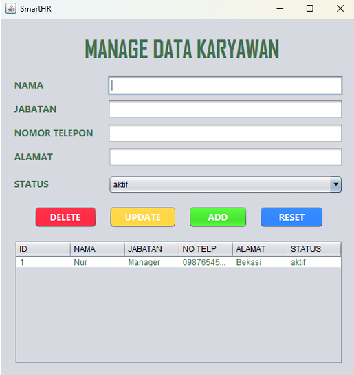

# Spring Boot Crud Project

## Description

This project is a simple Employee Management System developed using Java Spring Boot and Hibernate. It was created as an academic project. The application focuses on CRUD operations, database interaction using ORM, and a clean layered architecture

## Tools & Technologies
- Java
- Spring Boot
- Hibernate / JPA
- MySQL
- Maven
- NetBeans IDE

## Features

- Create, read, update, and delete employee data
- REST-style backend logic
- Database mapping using JPA annotations
- Transaction handling with Hibernate
- Layered architecture (Controller, Entity, Repository)
